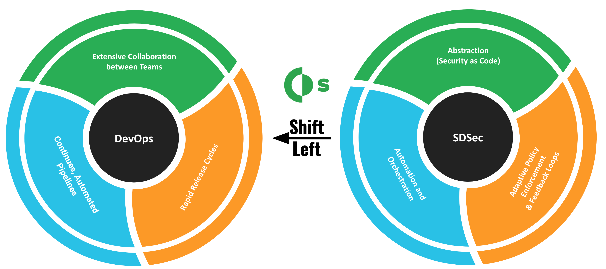
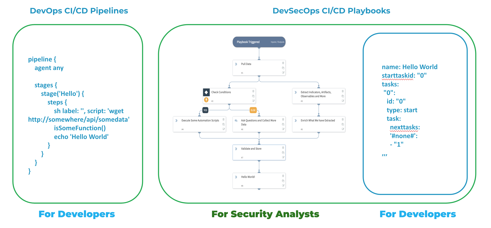
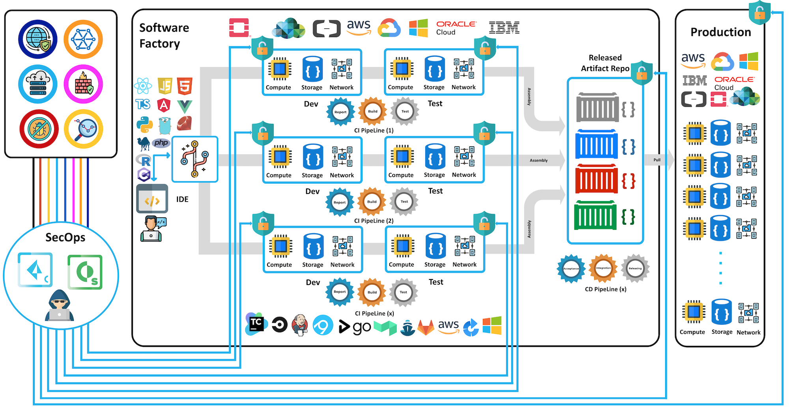
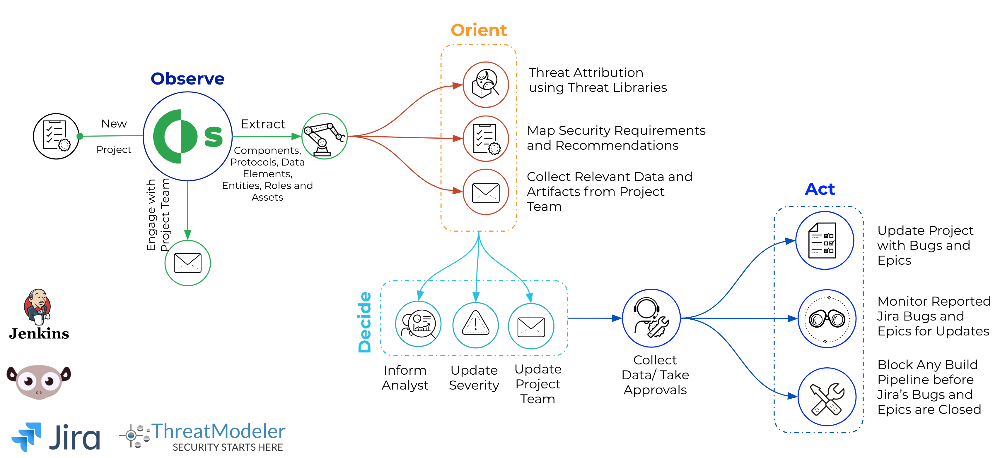
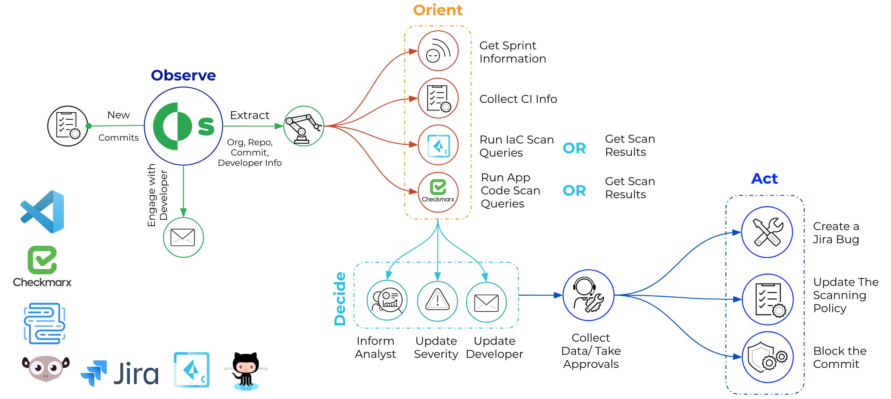
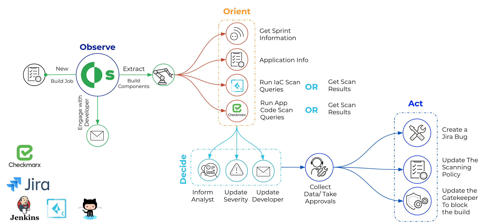
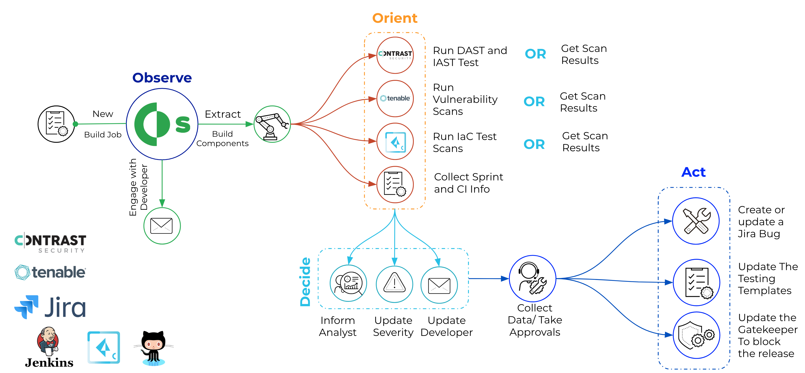
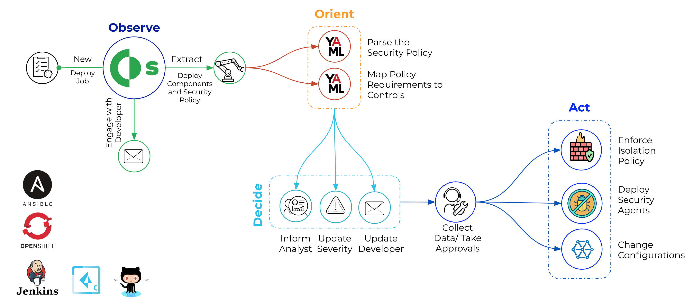
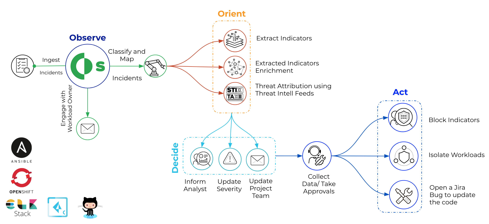

## Inspiration
DevSoarOps project was inspired by the notion of Getting the SOAR out of the SOC boundary to the DevOps Eco-System from one angel; And from another angel, Expanding the SOC service catalog to address a new territory of use cases : **DevSecOps Use Cases** .

Three factors in our view can enable organizations - with the help of SOAR technology - to shift security as left as the planning stage of a continues integration pipeline and make DevSecOps to be within reach, these factors are:
- Software Defined Everything including security controls provides a layer of abstraction that allows the functions of these controls to be called in CI/CD pipeline. 
- Market's decision that directed security vendors to open their platforms for integrations through standard API interfaces. Closed platforms offerings are no longer in play, no matter how good these platforms are.
- Automation and Orchestration in the security space has started already with SOAR technology, can easily tap into DevOps Eco-System.

CI/CD orchestration tools such as Jenkins, CircleCI and others were primarily built by and to developers, SOAR is better positioned to cover this orchestration gap between DevOps and SecOps for the following reasons:

- While CI/CD orchestration pipelines are easily readable by developers , SOAR provides the same orchestration workflow in two formats readable by both Developers and Security Analysts.

- SOAR provides way more to a DevSecOps Eco-System:collaboration between teams members in the Eco-System, cases management, central reporting and long list of out of box integrations with security tools.

## What it does

## How we built it

## Challenges we ran into

## Accomplishments that we're proud of

## What we learned

## What's next for DevSecOps Automation and Orchestration
