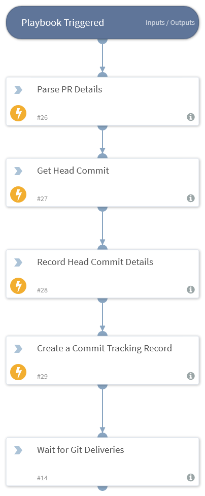

## Inspiration
DevSoarOps project was inspired by the notion of Getting the SOAR out of the SOC boundary to the DevOps Eco-System from one angel; And from another angel, Expanding the SOC service catalog to address a new territory of use cases : **DevSecOps Use Cases** .

Three factors in our view can enable organizations - with the help of SOAR technology - to shift security as left as the planning stage of a continues integration pipeline and make DevSecOps to be within reach, these factors are:
- Software Defined Everything including security controls provides a layer of abstraction that allows the functions of these controls to be called in CI/CD pipeline. 
- Market's decision that directed security vendors to open their platforms for integrations through standard API interfaces. Closed platforms offerings are no longer in play, no matter how good these platforms are.
- Automation and Orchestration in the security space has started already with SOAR technology, can easily tap into DevOps Eco-System.

CI/CD orchestration tools such as Jenkins, CircleCI and others were primarily built by and to developers, SOAR is better positioned to cover this orchestration gap between DevOps and SecOps for the following reasons:

* While CI/CD orchestration pipelines are arguably easy to read and troubleshoot by developers , SOAR provides the same orchestration workflow in two different formats that are readable by both Developers and Security Analysts.

* SOAR provides way more to a DevSecOps Eco-System than CI/CD Orchestrator does:
    * Collaboration between teams members in the Eco-System.
    * Cases management.
    * Central reporting and long list of out of box integrations with security tools.

## What it does

With couple of additional integrations, playbooks, fields - and UX components at a later stage - , XSOAR can be turned into a DevSoarOps Orchestrators that taps in a DevSecOps Eco-System and solve for a spectrum of use cases in different stages of CI/CD piplines.

From threat-modeling in the **Planning** stage to IaC security in **Dev**, static code analysis in **Build**, post deployment scans in **Deploy** and **Monitoring**/Responding to incidents once the code is running in production.

DevSoarOps does that via a number of integrations with different software factory tools:
- IDE's 
- Code Repo Providers
- CI/CD Orchestrators
- Code Compilers/Builders/Packagers
- Workload Orchestration Platforms
- Configuration Automation Tools
- Threat Modelers
- SAST/DAST/IAST Tools
- Vulnerability Scanners
- Networks Security Tools
- Asset Management Tools
- Log Management Tools
- Ticketing Systems

And a number of DevSecOps Automation Playbooks, the following are some of the Playbooks that I am working on: 

* **Plan**: New Sprint Threat Modeling Playbook

* **Dev**: Discover and Eradicate APP & IaC Code Vuln’s and Policy Violations

* **Build**: Identify vulnerabilities in the dependent components 

* **Test**: Tests and vulnerability management  

* **Deploy**: Policy as Code Enforcement

* **Monitor**: Security Incident Investigation and Response

## How I built it
I started planning for this project by mocking a software factory that has a number of tools in two CI & CD Pipelines:

I have coded two new integrations to implement "Discover and Eradicate APP & IaC Code Vuln’s and Policy Violations" automation/orchestration use case (above) :
* Github long running integration to process Git webhook deliveries
* LGTM ( A SAST cloud service built on CodeQL) integration with the following commands:
    * lgtm-get-project-by-url to get the SAST project details 
    * lgtm-get-project-config to get Extraction and Analysis config by LGTM Project ID
    * lgtm-get-analysis-status to get get PR/Commit Analysis Results by analysis ID
    * lgtm-get-alerts-details to get Alerts Details by Analysis ID if any alerts triggered
    * lgtm-run-commit-analysis to run on-demand SAST analysis on one Commit
    * lgtm-run-project-query to on-demand SAST analysis on a Github Repo

And then created two new incident types along with new custom fields:
* New Git PR incident

* New App Task incident

Multiple playbooks are created to achieve this sample "Discover and Eradicate APP & IaC Code Vuln’s and Policy Violations" use case:
* A PR triage Playbook that parse and record the PR details once the PR webhook delivery is received by the new Github LR integration.

* A Github App Task analysis Playbook that parses the received Github App Task delivery, create vulnerability indicators if any vuln found and then link the App Task incident&indicators to the PR incident

* The App Task analysis Playbook has two subplaybooks:
    * LGTM Task Analysis Playbook, the parses the LGTM task deliveries and create SAST vuln indicators if any
 
    * Prisma Cloud Task Analysis Playbook, the parses the Prisma task deliveries and create IAST vuln indicators if any
 

## Challenges I ran into
XSOAR UX was built mainly for SOC analysts, ingesting DevOps data into the SOAR would require additional UX components that maps a pipeline of tasks, I was able to work around that by using multiple incident types and playbooks that maps incidents (Pipeline tasks) together.   

## Accomplishments that I'am proud of
I did Demo the "Discover and Eradicate APP & IaC Code Vuln’s and Policy Violations" playbook to a major bank that has an advanced DevOps Eco-System and the feedback was rewarding to my efforts working on this project.

## What I learned
* Evaulating security controls in a very competitive market is no longer about a nice UI interface nor an integrated platform from one vendor, but rather the openness of these controls to integrations with other controls and how much automation does these controls have.
* SOAR Technology is well positioned to shift security to the very left of the software development life cycle.

## What's next for DevSecOps Automation and Orchestration
More integrations and more playbooks :)